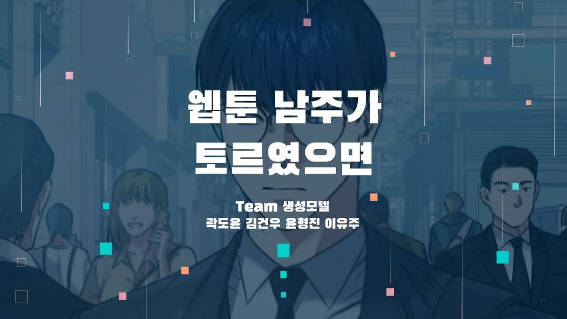
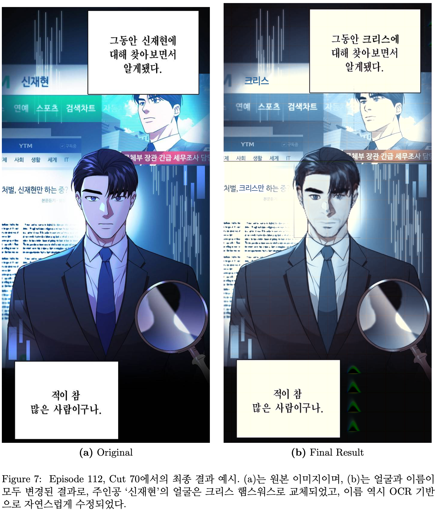
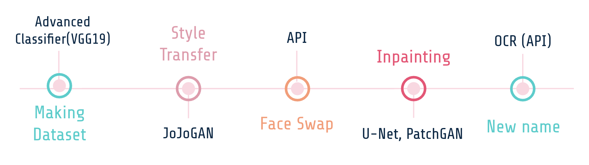
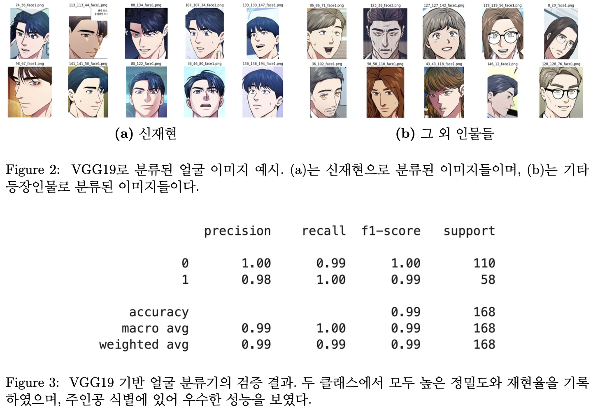
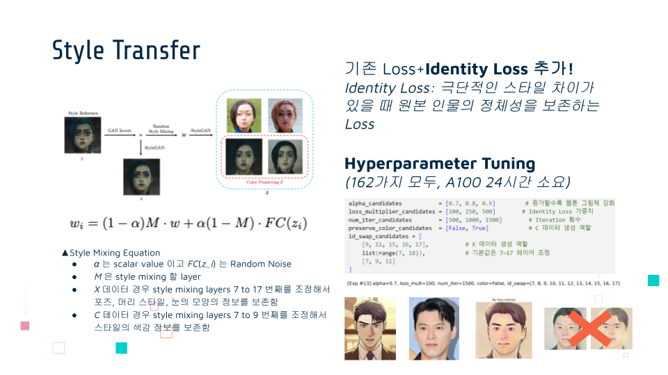
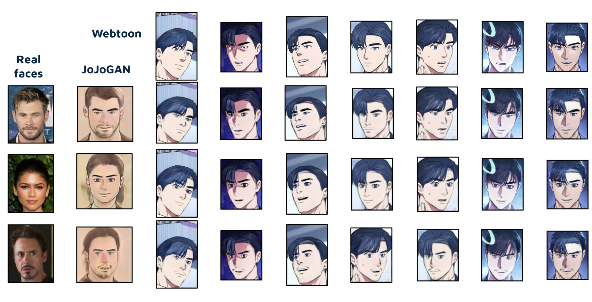
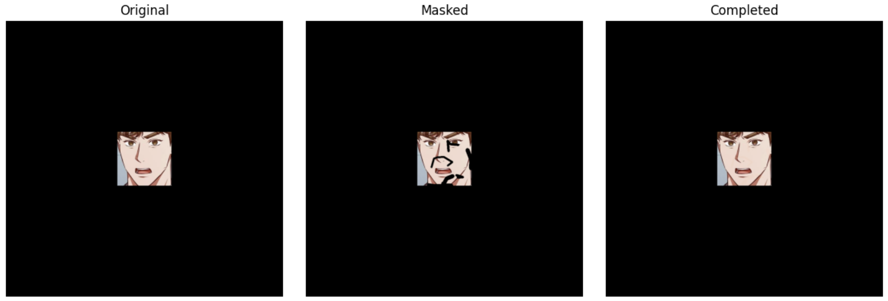
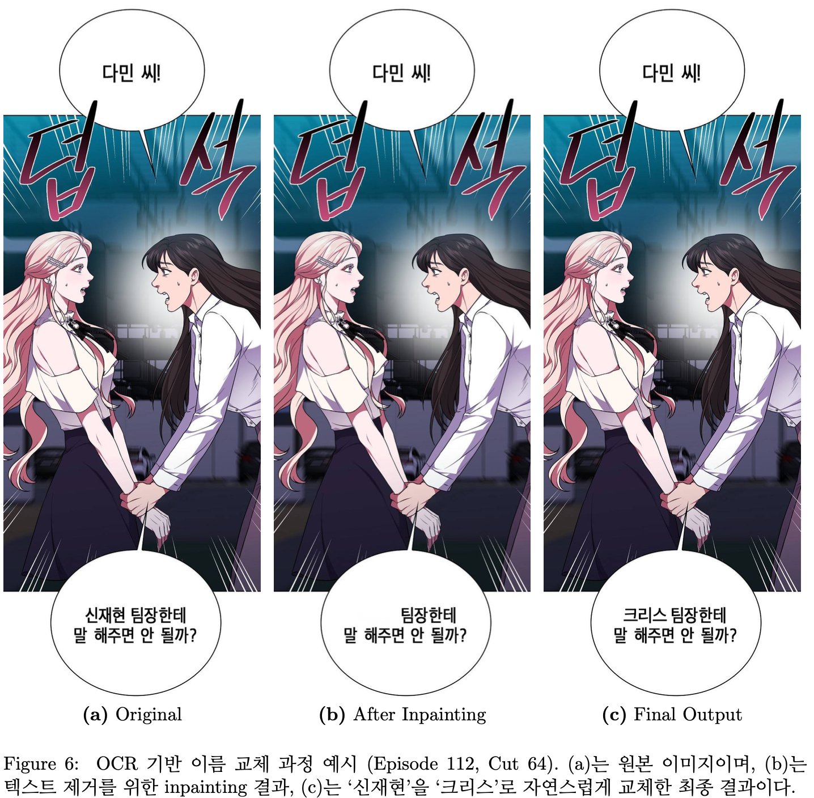

# 25-1_DSL_Modeling_GM_Webtoon_Face_Swap

**DSL 25-1 모델링 프로젝트 2위에 빛나는 바로 그 프로젝트 😎 모두를 웃게 만든 바로 그 프로젝트 😎**  
  
**여러분도 따라하고 싶으신가요?**  
**잘 찾아오셨습니다!**  
**순서대로 따라오시면, 그 어떤 웹툰도 여러분의 마음대로 주인공의 얼굴을 원하는 사람의 얼굴로 바꿔치기할 수 있습니다!**  

# Webtoon Face Transformation Pipeline

## Introduction

본 프로젝트는 네이버 웹툰 **'국세청 망나니'** 의 주인공 **'신재현'** 의 얼굴을 사용자가 선택한 다른 얼굴(예: 크리스 햄스워스)로 자연스럽게 교체하는 생성모델 기반 이미지 변환 파이프라인입니다.

본 파이프라인은 다음의 과정을 포함합니다:

## Pipeline Overview

1. **Data Collection & Preprocessing**
   - 웹툰 이미지 수집 후, 얼굴 영역 크롭 및 고화질 필터링
2. **Face Classification**
   - CLIP + Logistic Regression으로 초기 필터링 후, VGG19 모델로 주인공 얼굴 분류
      
3. **Style Transfer**
   - JoJoGAN으로 원본 얼굴의 Identity를 유지하며 스타일 전이
     
4. **Face Swap**
   - Facial Landmark를 기반으로 자연스러운 얼굴 교체
     
5. **Face Inpainting**
   - 경계 복원 및 자연스러운 이미지 완성
     
6. **OCR-based Name Replacement**
   - 주인공 이름을 선택한 이름으로 교체
     


## Important Notes

### ⚠️ OCR API Key 직접 발급 필요

- 본 프로젝트는 **Upstage OCR API**를 사용합니다.
- [Upstage OCR](https://upstage.ai/document-ai)에서 회원가입 후 **직접 API Key를 발급** 받아야 합니다.
- **주의:** 무료 플랜이 존재하지만, 사용량 초과 시 **추가 과금**이 발생할 수 있습니다.
- API Key는 파이프라인 실행 시 인자로 전달해야 합니다.

### ⚠️ 웹툰 크롤링 데이터 비공개

- 웹툰 이미지 데이터셋은 저작권 문제로 인해 **공개하지 않습니다.**
- 필요한 경우 **프로젝트 개발자에게 별도 문의**하시기 바랍니다.


## Project Structure
```
Demo.ipynb 

project
    |--- rawdata
    |       |--- 1  
    |       |--- 2  
    |       |--- 3  
    |       |--- 4  
    |       .       
    |       .       
    |       .       
    |       |--- 112
    |          
    |          
    |--- dataset
    |       |--- 1    
    |       |--- 2    
    |       |--- 3    
    |       |--- 4    
    |       .       
    |       .       
    |       .       
    |       |--- 112
    |             |--- img
    |             |--- label
    |
    |--- scripts
		|	    |--- WebToonCompiler.py
		|	    |--- utils.py
    |	    |--- styletransfer.py
    |	    |--- faceswap.py
    |	    |--- inpainting.py
    |
    |--- JoJoGAN
    |
    |
    |--- settings
    |     
    |
    |--- results
    |       |--- 1
    |       |--- 2
    |       |--- 3
    |       |--- 4
    |       .
    |       .
    |       .
    |       |--- 112
		|             |--- temporary_crops 
    |             |--- temporary_jsons
    |             |--- cropped_faces
    |             |--- cropped_faces_json
    |             |--- presized_tem_cropped_faces
    |             |--- presized_tem_padding_info.pkl
    |             |--- ocr_results
    |             |--- style_transferred_images
    |             |--- face_swapped_images
    |             |--- final_result
    |    
    |--- real_faces
            |--- chris
            |--- tony
            |--- zendaya
```


## Requirements

- Python >= 3.8
- PyTorch >= 1.12
- OpenCV
- torchvision
- matplotlib
- Upstage OCR API Access

(※ `requirements.txt` 제공 예정)


## Installation

### 1. Clone the repository

```bash
git clone https://github.com/DataScience-Lab-Yonsei/25-1_DSL_Modeling_GM_Webtoon_Face_Swap.git
cd 25-1_DSL_Modeling_GM_Webtoon_Face_Swap
```

### 2. Quick Start

⭐️ Demo.ipynb ⭐️ 파일을 열어주세요!
OCR API Key와 사용할 얼굴 이미지를 준비한 후, 전체 파이프라인을 손쉽게 실행할 수 있습니다.


## Performance

- **Face Classification:** Precision 0.99 / Recall 1.00
- **Style Transfer:** Identity preservation 성공
- **Face Swap & Inpainting:** 자연스러운 연결성 유지
- **OCR-based Replacement:** 자연스러운 텍스트 교체 완료
  

## Limitations and Future Work
- 얼굴 포즈/표정 차이에 따른 Style Transfer 품질 한계
- Deepfake 기술 사용에 따른 윤리적 이슈 존재
- 향후 Invisible Watermark 기술 적용 예정


## Contact
궁금한 점이나 웹툰 데이터 요청은 저작권 상의 이유로 개발자에게 문의해주세요! 


## License
본 프로젝트는 현재 별도의 오픈소스 라이센스를 적용하고 있지 않습니다. (All rights reserved)
